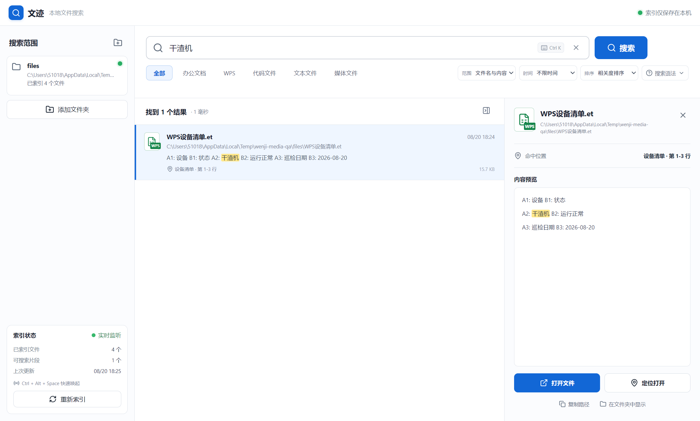
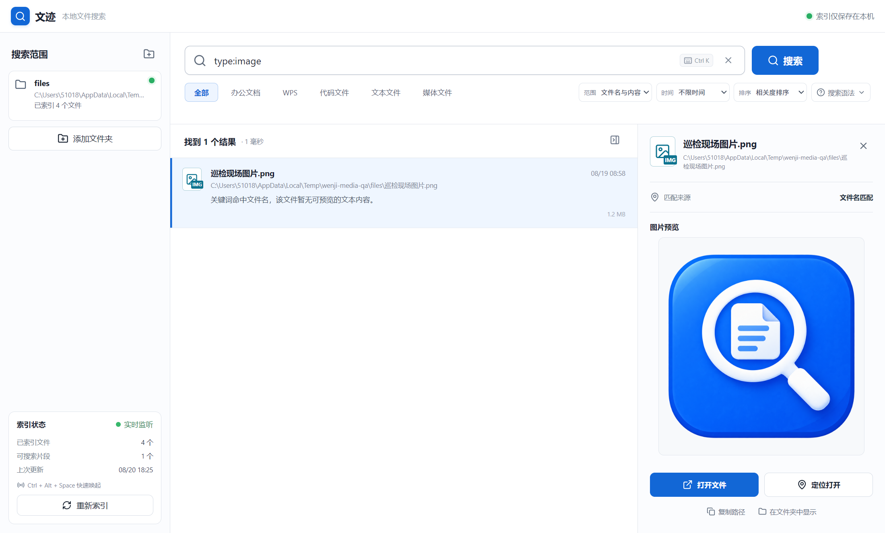
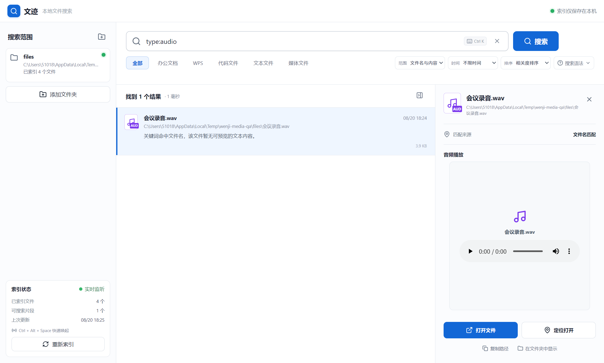

# 文迹 Wenji

> 一款面向 Windows 的轻量级本地文件名与内容搜索工具。

[](https://github.com/zhangnanydl/wenji-local-search/releases/latest)
[](https://github.com/zhangnanydl/wenji-local-search/releases/latest)
[](LICENSE)

文迹会在本机为指定文件夹建立索引，同时搜索文件名和文件内容。它支持 Office、WPS、代码、普通文本以及图片、音频、视频文件；索引和解析出的文字只保存在电脑中，不会上传到网络。

## 下载

推荐普通用户下载 **安装版**；需要放在 U 盘中使用或不希望安装时，可选择 **免安装版**。

| 版本 | 适合场景 | 下载 |
| --- | --- | --- |
| Windows 安装版 | 支持选择安装目录、创建桌面快捷方式 | [下载 Wenji-Setup-1.6.0.exe](https://github.com/zhangnanydl/wenji-local-search/releases/latest/download/Wenji-Setup-1.6.0.exe) |
| Windows 免安装版 | 下载后直接运行，不写入安装目录 | [下载 Wenji-Portable-1.6.0.exe](https://github.com/zhangnanydl/wenji-local-search/releases/latest/download/Wenji-Portable-1.6.0.exe) |

也可以前往 [Releases 页面](https://github.com/zhangnanydl/wenji-local-search/releases/latest) 查看版本说明和全部附件。

> Windows 可能会显示“未知发布者”或 SmartScreen 提示，因为当前构建没有购买商业代码签名证书。项目源码和构建配置均已公开，可自行检查或构建。

## 界面预览

### 搜索 WPS 表格内容

文迹可以检索 `.et/.ett` 文件中的单元格文字，显示命中的工作表和行，并在右侧预览原文。



### 图片搜索与预览

图片等媒体文件可按文件名、扩展名、修改时间和大小查找；选中图片后会在详情区加载预览。



### 音频搜索与播放

音频和视频会使用系统内置的 Chromium 媒体能力播放，不会将文件上传到在线播放服务。



## 主要功能

- 文件名与文件内容同时搜索，并高亮显示关键词。
- 首次选择目录时显示扫描、索引进度和当前处理文件。
- 文件新增、修改、重命名或删除后自动进行增量索引。
- 支持精确短语、排除关键词以及 `name:`、`content:`、`ext:`、`type:` 搜索语法。
- 按办公文档、WPS、代码、文本、媒体类型筛选。
- 按命中范围、修改时间筛选，按相关度、时间、名称或大小排序。
- 结果详情提供内容预览、图片预览、音频播放和视频播放。
- 双击打开文件，或尝试定位到 Word 文字、表格单元格、演示幻灯片和文本行。
- 右键菜单支持打开、定位、复制完整路径和在资源管理器中显示。
- 支持系统托盘以及 `Ctrl + Alt + Space` 全局唤起。
- 搜索框快捷键为 `Ctrl + K`，按 `Esc` 可以清空关键词。

## 支持的文件格式

| 分类 | 扩展名或文件类型 | 检索方式 |
| --- | --- | --- |
| Word / WPS 文字 | `.docx` `.docm` `.dotx` `.dotm` `.doc` `.dot` `.rtf` `.wps` `.wpt` | 文件名与正文 |
| Excel / WPS 表格 | `.xlsx` `.xlsm` `.xltx` `.xltm` `.xls` `.xlt` `.et` `.ett` | 文件名与单元格文字 |
| PowerPoint / WPS 演示 | `.pptx` `.pptm` `.ppsx` `.ppsm` `.potx` `.potm` `.ppt` `.pps` `.pot` `.dps` `.dpt` | 文件名与幻灯片文字 |
| 代码 | Python、Java、JavaScript、TypeScript、C/C++、C#、Go、Rust、Swift、PHP、Ruby、SQL、Shell、PowerShell、HTML/CSS、Vue、Svelte 等 | 文件名与文本内容 |
| 文本与配置 | `.txt` `.md` `.log` `.json` `.yaml` `.xml` `.ini` `.toml` `.csv` `.tsv` `.env` 等 | 文件名与文本内容 |
| 图片 | `.jpg` `.jpeg` `.png` `.gif` `.webp` `.bmp` `.svg` `.ico` `.avif` `.tif` `.tiff` `.heic` | 文件名和属性，可预览兼容格式 |
| 音频 | `.mp3` `.wav` `.flac` `.m4a` `.aac` `.ogg` `.wma` `.opus` 等 | 文件名和属性，可播放兼容格式 |
| 视频 | `.mp4` `.m4v` `.mov` `.avi` `.mkv` `.webm` `.wmv` `.flv` `.mpeg` `.mpg` `.ts` 等 | 文件名和属性，可播放兼容格式 |

新式 Office/WPS 文件采用本地解析。部分旧式二进制格式需要电脑上安装 WPS Office 或 Microsoft Office，文迹会通过本机 Office 自动化接口提取内容。

## 快速开始

1. 下载并运行安装版或免安装版。
2. 点击左侧的“添加文件夹”，选择需要搜索的目录。
3. 等待首次扫描和内容索引完成；窗口可以转入后台继续处理。
4. 在顶部输入文件名或正文关键词。
5. 单击结果查看详情，双击结果直接打开文件。
6. 需要精确位置时，点击右侧“定位打开”。

首次索引耗时与文件数量、文件大小以及 Office/WPS 文档数量有关。后续文迹只处理发生变化的文件，通常不需要再次完整扫描。

## 搜索语法

### 普通搜索

```text
干渣机
年度报告
设备报警
```

普通关键词会同时匹配文件名和文件内容。

### 精确短语和排除词

```text
"设备检修" -作废
```

- 双引号表示连续、完整的短语。
- 关键词前加 `-` 表示排除包含该词的结果。

### 限定搜索范围

```text
name:报告
content:报警
ext:et
type:office
type:wps
type:image
type:audio
type:video
```

| 语法 | 含义 | 示例 |
| --- | --- | --- |
| `name:` | 只匹配文件名 | `name:巡检` |
| `content:` | 只匹配可解析的正文 | `content:运行正常` |
| `ext:` | 限定扩展名 | `ext:docx`、`ext:et` |
| `type:` | 限定类别 | `type:office`、`type:wps`、`type:image` |

多个条件可以组合使用：

```text
name:设备 content:报警 ext:et -停用
```

## 筛选与排序

顶部筛选栏可以与搜索语法组合使用：

- **文件类别**：全部、办公文档、WPS、代码文件、文本文件、媒体文件。
- **匹配范围**：文件名与内容、仅文件名、仅文件内容。
- **修改时间**：不限时间、最近一天、最近一周、最近一月。
- **排序方式**：相关度、最近修改、文件名、文件大小。

单次最多显示 500 条结果，以保持界面流畅。缩短搜索范围或增加关键词可以获得更准确的结果。

## 打开和定位

| 文件类型 | “定位打开”的行为 |
| --- | --- |
| Word / WPS 文字 | 打开文档并尝试查找、选中命中文字 |
| Excel / WPS 表格 | 打开工作簿并尝试选择命中工作表和单元格区域 |
| PowerPoint / WPS 演示 | 打开演示并尝试跳转到命中幻灯片 |
| 文本和代码 | 使用 Windows 记事本打开并跳转到命中行 |
| 图片、音频和视频 | 使用系统默认程序打开文件 |

如果 Office/WPS 没有安装、格式不兼容或自动定位失败，文迹会回退为普通打开，不会修改原文件。

## 索引、性能与隐私

- 搜索目录、文件路径、索引和解析出的文字存放在 Electron 的本机 `userData` 目录。
- 文迹没有云端搜索服务，不会上传被索引的文件。
- 媒体文件目前只索引文件名和基础属性，不进行 OCR、语音识别或视频字幕转写。
- 文本类文件最大解析大小为 32 MB，防止单个超大日志文件占用过多内存。
- 预览只在选中结果时加载，列表不会同时读取大量图片或媒体文件。
- 某些 HEIC、旧式音视频编码能否预览或播放，取决于 Windows 与 Chromium 的解码支持；仍可用默认程序打开。

## 系统要求

- Windows 10 或 Windows 11，64 位系统。
- 建议至少 4 GB 内存。
- 解析旧版 `.doc/.xls/.ppt` 或旧式 WPS 专有文件时，需要安装 WPS Office 或 Microsoft Office。

## 本地开发

需要 Node.js 20 或更高版本。

```powershell
git clone https://github.com/zhangnanydl/wenji-local-search.git
cd wenji-local-search
npm install
npm run dev
```

生产构建：

```powershell
npm run build
```

生成 Windows 安装版和免安装版：

```powershell
npm run dist
```

构建产物位于 `release` 目录。

## 项目结构

```text
wenji-local-search/
├─ electron/
│  ├─ main.cjs          # 索引、解析、搜索、托盘和文件打开
│  └─ preload.cjs       # 安全的渲染进程 API
├─ src/
│  ├─ App.jsx           # React 主界面和交互
│  ├─ App.css
│  └─ enhancements.css
├─ docs/images/         # README 截图
├─ build/               # 应用图标
└─ package.json
```

## 常见问题

### 为什么能找到文件名，但没有正文预览？

媒体文件本身只搜索文件名和属性；加密、损坏、受保护或不受支持的 Office/WPS 文件也可能只能搜索文件名。索引状态中会显示未能解析的文件数量。

### 为什么修改文件后暂时搜不到？

增量索引会短暂合并连续的文件变化。通常等待数秒即可；也可以点击左下角“重新索引”。

### 为什么全局快捷键没有生效？

`Ctrl + Alt + Space` 可能已经被其他软件占用。此时文迹仍可从系统托盘或桌面快捷方式打开。

### 为什么安装版出现安全提示？

当前发布包尚未进行商业代码签名。请只从本仓库的 [Releases](https://github.com/zhangnanydl/wenji-local-search/releases) 下载，或按照上面的步骤自行构建。

## 参与贡献

欢迎提交 [Issue](https://github.com/zhangnanydl/wenji-local-search/issues) 和 Pull Request。提交代码前请至少确认：

```powershell
node --check electron/main.cjs
node --check electron/preload.cjs
npm run build
```

## License

本项目采用 [MIT License](LICENSE)。
